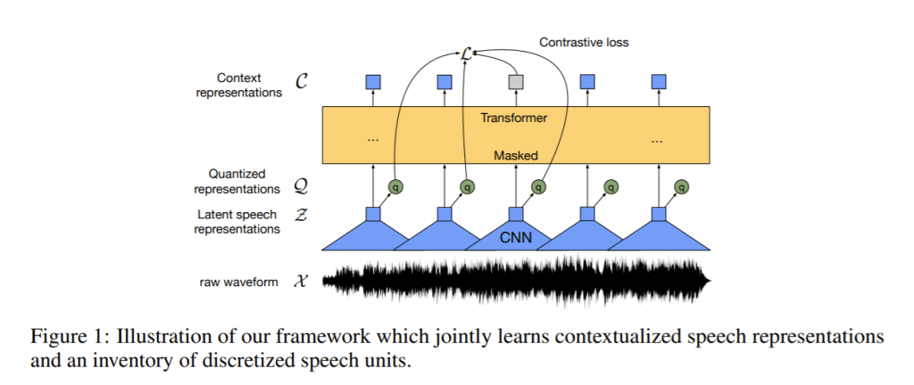

[](https://github.com/phanxuanphucnd/wav2asr)
[](https://github.com/phanxuanphucnd/wav2asr/blob/main/LICENSE)


## Table of contents

1. [Introduction](#introduction)
2. [How to use `arizona asr`](#how_to_use)
    - [Installation](#installation)
    - [Data structure](#data_structure)
    - [Example usage](#usage)

3. [Reference](#reference)


## <a name='introduction'></a> Introduction

A `simple`, `easy-to-use` toolbox version wrapped wav2vec 2.0 framework for **Automatic Speech Recognition (ASR)** task, which attempts to build a accurate speech recognition models with small amount of transcribed data. (eg. 1 hour).

Transfer learning is still the main technique:

- Transfer from self-supervised models (pretrain on unlabeled data)
- Transfer from multingual models (pretrain on multingual data)




## <a name='how_to_use'></a> How to use `arizona asr`

### Installation <a name='installation'></a>

- Install dependencies ``fairseq`` and ``wav2letter``:

```js

>>> pip install libs/fairseq-1.0.0a0+9b5b09b-cp36-cp36m-linux_x86_64.whl

>>> sudo apt-get update && sudo apt-get -y install apt-utils libpq-dev libsndfile-dev

>>> sudo apt install libboost-system-dev libboost-thread-dev libboost-program-options-dev libboost-test-dev libeigen3-dev zlib1g-dev libbz2-dev liblzma-dev

>>> sudo apt-get install libsndfile1-dev libopenblas-dev libfftw3-dev libgflags-dev libgoogle-glog-dev

```

- Install ``kenlm`` and ``wav2letter`` decoder bindings:

```js

>>> git clone https://github.com/kpu/kenlm.git

>>> cd kenlm

>>> mkdir -p build && cd build

>>> cmake ..

>>> make -j 4

>>> cd ../..

>>> git clone -b v0.2 https://github.com/facebookresearch/wav2letter.git

>>> cd wav2letter/bindings/python

>>> export KENLM_ROOT_DIR={path_to_libs_kenlm} && pip install -e .

>>> cd ../../..


Note: path_to_libs_kenlm: is the path to the folder kenlm cloned above.

```


- Install ``arizona asr`` library:

```js

>>> python setup.py bdist_wheel

>>> pip install dist/arizona-0.0.1-py3-none-any.whl 

```

### Data structure <a name='data_structure'></a>

```

data
├── label_data
│   │   transcript.txt
│   └── audios
│       │   file111.wav
│       │   file112.wav
│       │   ...
│   
├── unlabel_data
│   │   file021.wav
│   │   file022.wav
│   │   ...
│
├── dict.txt
└── text_corpus.txt

```

- **Transcript file:**

    - One trainng sample per line with format:

    ```
    audio_absolute_path \tab transcript
    ```

    - Examples of a transcript file:

    ```

    /path/to/1.wav AND IT WAS A MATTER OF COURSE THAT IN THE MIDDLE AGES WHEN THE CRAFTSMEN
    /path/to/2.wav AND WAS IN FACT THE KIND OF LETTER USED IN THE MANY SPLENDID MISSALS PSALTERS PRODUCED BY PRINTING IN THE FIFTEENTH CENTURY
    /path/to/3.wav JOHN OF SPIRES AND HIS BROTHER VINDELIN FOLLOWED BY NICHOLAS JENSON BEGAN TO PRINT IN THAT CITY
    /path/to/4.wav BEING THIN TOUGH AND OPAQUE

    ```

    NOTE:
    - One sample per line
    - Upper case
    - All numbers should be transformed into verbal form
    - All special characters (eg. punctuation) should be removed. The final text should contain words only
    - Words in a sentence must be separated by whitespace character
    - Labeled audio file:
        - Format: wav, PCM 16 bit, single channel, Sampling_rate: 16000.
        - Silence should be removed from the audio.
        - Also, each audio should contain only one person speaking.

- **Text corpus:**

    - Collect all texts and put them all together in a single file.
    
    - Text file format:
        - One sentence per line
        - Upper case
        - All numbers should be transformed into verbal form.
        - All special characters (eg. punctuation) should be removed. The final text should contain words only Words in a sentence must be separated by whitespace character

    - Examples of a text corpus:

    ```

    AND IT WAS A MATTER OF COURSE THAT IN THE MIDDLE AGES WHEN THE CRAFTSMEN
    AND WAS IN FACT THE KIND OF LETTER USED IN THE MANY SPLENDID MISSALS PSALTERS PRODUCED BY PRINTING IN THE FIFTEENTH CENTURY
    JOHN OF SPIRES AND HIS BROTHER VINDELIN FOLLOWED BY NICHOLAS JENSON BEGAN TO PRINT IN THAT CITY
    BEING THIN TOUGH AND OPAQUE
    ...

    ```

### Examples usage <a name='usage'></a>

**- Pretraining from unlabel-data:**

```js

>>> arizona asr pretraining --audio_path path/to/audio_directory --init_model wav2vec-small-en

Arguments:

Required-arguments:
    --audio_path AUDIO_PATH         Path to the unlabeled audio data.
    --init_model INIT_MODEL         The name of pretrained model or path to the pretrain wav2vec model.

Optional-arguments:
    --batch_size                    Batch size, try to decrease this number if any CUDA memory problems occur.
    --help, -h                      Show this help message and exit.

```

NOTE:
- init_model: The library provide somes optionals [`'wav2vec-small-en'`, `'wav2vec-small-vi'`].
- Logs and checkpoints will be stored at outputs directory.
- Log_file path: `outputs/date_time/exp_id/hydra_train.log`. You should check the loss value to decide when to stop the training process.
- Best_checkpoint path: `outputs/date_time/exp_id/checkpoints/checkpoint_best.pt`.

**- Finetuning from labeled-data:**

```js

>>> arizona asr finetuning --audio_path path/to/audio_directory --pretrain_model path/to/pretrain_checkpoint_best.pt

Arguments:

Required-arguments:
    --transcript_file TRANSCRIPT_FILE       Path to the transcript file.
    --pretrain_model PRETRAIN_MODEL_PATH    The name of pretrained model or path to the pretrained Wav2vec model.

Optional-arguments:
    --batch_size BATCH_SIZE                 Batch size, try to decrease this number if any CUDA memory problems occur.
    --pct PCT                               Percentage of data use for validation.
    --seed SEED                             The number of random seed state.
    --restore_file RESTORE_FILE             Resume training from fine-tuned checkpoint.
    --help, -h                              Show this help message and exit.

```

**- Train a Language model:**

```js

>>> arizona asr train-lm --kenlm path/to/libs/kenlm --transcript_file path/to/transcript.txt --additional_file path/to/text_corpus.txt --ngram 3 --output_path ./lm

Arguments:

Required-arguments:
    --transcript_file TRANSCRIPT_FILE   Path to the transcript file.
    --output_path OUTPUT_PATH           Path to storage LM model and the lexicon file.

Optional-arguments:
    --kenlm KENLM_PATH                  Path to the installed kenlm library (default='./kenlm').
    --additional_file ADDITIONAL_FILE   Path to the text corpus.
    --ngram N_GRAM                      N gram (default=3).
    --help, -h                          Show this help message and exit.

```

**- Inferene a given utterance:**

```js

from arizona.asr.learner import Wav2AsrLearner

learner = Wav2AsrLearner(
    pretrain_model='path/to/pretrain.pt', 
    finetune_model='path/to/finetune.pt', 
    dictionary='path/to/dict.ltr.txt',
    lm_type='kenlm',
    lm_lexicon='path/to/lm/lexicon.txt', 
    lm_model='path/to/lm/lm.bin',
    lm_weight=1.5, 
    word_score=-1, 
    beam_size=50
)

hypos = learner.transcribe([
    'path/to/wavs/0_1.wav', 
    'path/to/wavs/0_2.wav'
])

print(hypos)

```

NOTE: 
- If you running inference in a juyter notebook. Please add these lines above the inference script:

    ```py

    import sys
    sys.argv = ['']

    ```


## <a name='reference'></a> Reference

[1] D.J Seo, H.S Oh and Y.C Jung: “[Wav2KWS: Transfer Learning from Speech Representations for Keyword Spotting](https://ieeexplore.ieee.org/stamp/stamp.jsp?tp=&arnumber=9427206)”, in IEEE 2021.

[2] Alexei Baevski, Henry Zhou, Abdelrahman Mohamed and Michael Auli: “[wav2vec 2.0: A Framework for Self-Supervised Learning of Speech Representations](https://arxiv.org/pdf/2006.11477.pdf)”, in arXiv:2006.11477, 2020.


## License

```
MIT License

Copyright (c) 2021 Phuc Phan

Permission is hereby granted, free of charge, to any person obtaining a copy
of this software and associated documentation files (the "Software"), to deal
in the Software without restriction, including without limitation the rights
to use, copy, modify, merge, publish, distribute, sublicense, and/or sell
copies of the Software, and to permit persons to whom the Software is
furnished to do so, subject to the following conditions:

The above copyright notice and this permission notice shall be included in all
copies or substantial portions of the Software.

THE SOFTWARE IS PROVIDED "AS IS", WITHOUT WARRANTY OF ANY KIND, EXPRESS OR
IMPLIED, INCLUDING BUT NOT LIMITED TO THE WARRANTIES OF MERCHANTABILITY,
FITNESS FOR A PARTICULAR PURPOSE AND NONINFRINGEMENT. IN NO EVENT SHALL THE
AUTHORS OR COPYRIGHT HOLDERS BE LIABLE FOR ANY CLAIM, DAMAGES OR OTHER
LIABILITY, WHETHER IN AN ACTION OF CONTRACT, TORT OR OTHERWISE, ARISING FROM,
OUT OF OR IN CONNECTION WITH THE SOFTWARE OR THE USE OR OTHER DEALINGS IN THE
SOFTWARE.
```

  
## Author

**Arizona asr** was developed by Phuc Phan © Copyright 2021.

For any questions or comments, please contact the following email: phanxuanphucnd@gmail.com

Thank you for your interesting to ``Arizona asr``!